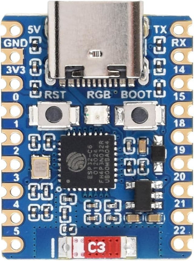
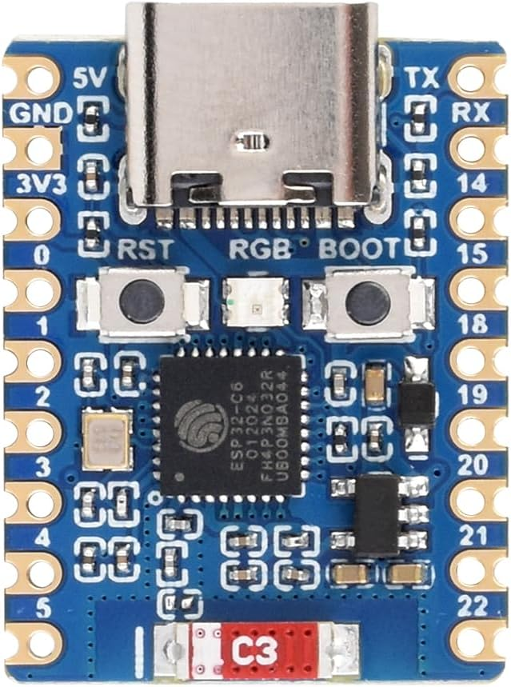
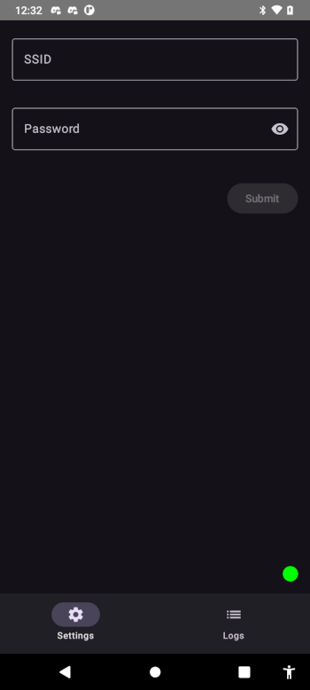

# ESP32 G-Shock Time Server

<p>
  
  
  
  
  
</p>

This project provides an **ESP32-based** time server for Casio G-Shock watches. The ESP32 is a tiny, low-cost microcontroller with built-in WiFi and Bluetooth. This server enables your G-Shock to connect and set its correct time. In addition, it displays some information about your watch.

Just like your G-Shock itself, it’s designed to be set-and-forget. Just start the server once—it will run reliably for months with no user intervention.

[](https://youtu.be/xCLqY8-jATQ)

***

## Features

- **BLE Time server** for setting your G-Shock's correct time
- **Touch and display support** (ST7789 LCD)  
- **Battery and temperature display**  

***

## Requirements

- `ESP32-C6-Touch-LCD-1.47` micro controller with a touch-enabled display.  
- MicroPython firmware  
- `mpremote` for file transfer  

***

## Hardware

The currently supported hardware is `ESP32-C6-Touch-LCD-1.47`. Make sure it is exactly this display, because pins differ for similar displays, even from the same manufacturer. Also, the `touch` function is used to wake up the display, so make usre it is exactly the same model. You can get it at [Amazon](https://amzn.to/3K5IhXz) or [AliExpress](https://s.click.aliexpress.com/e/_oEn3un7) (sponsored).



***
Alternatively, you can get an even cheaper [Super Mini ESP32-E6](https://www.espboards.dev/esp32/esp32-c6-super-mini/). 
You can get it at [Amazon](https://amzn.to/4gnInG8) or [AliExpress](https://s.click.aliexpress.com/e/_oDtUtRL) (sponsored). 



This device does not have a display but uses an LED to show the current status:

- Pulsating green every 5 seconds — normal operation, waiting for a connection.

- Changing colors — the device is connected to a watch, and watch's time is being updated.

- Blinking blue — the device is in configuration mode and is waiting for the Android app to connect.

- Blinking red — some error has occurred, such as an invalid configuration file.

***

## Getting Started

### 1. Installing the Software

## Server Software Structure

- `main.py` – Main entry point for the ESP32 server  
- `config_server.py` – Configuration server used to connect to the supporting Android app and receive configuration information  
- `gshock_server.py` / `gshock_server_no_display.py` – Main G-Shock server logic (with/without display)  
- `lib/` – Core libraries:  
  - `display/` – Display and LED control (ST7789, fonts, icons)  
  - `config/` – Configuration management  
  - `gshock_api/` – Software to connect and communicate with G-Shock watches  
  - `utils/` – Utility functions and persistent storage  

***

**Download the latest firmware:**  
- Follow the instructions [here](https://micropython.org/download/ESP32_GENERIC_C6/) to download and install the latest MicroPython firmare on your device. 

> Note: On Linux, the port is typically `/dev/ttyACM0`.

- install mpremote

```
pip install mpremote
```

**Deploy the Server Software:**  
Copy project files to the ESP32:
```
python sync.py
```

***

### 2. Configure WiFi

The server needs an internet connection to get the correct time. You must therefore provide a way for it to connect to your WiFi network. Here is how to configure it:

#### Method 1: Manual Installation

Create a `config.json` file with your WiFi credentials and timezone:
```
{
  "ssid": "YourWiFiSSID",
  "password": "YourWiFiPassword",
  "timezone": "Continent/City"
}
```
Make sure your timezone is in the correct format. Here is a [link to all valid timezones](http://worldtimeapi.org/api/timezone)

Copy the file to the device:
```
mpremote connect /dev/ttyACM0 fs cp config.json :config.json
```

Reset or Power OFF/ON the device.

#### Method 2: Using the Android App (recommended)

- Alternatively, download and install the Android APK on your phone: [⬇️ Download Latest APK](https://github.com/izivkov/gshock-api-esp32/releases/download/v1.0.0/TimeServerConfigurator.apk). You can find sources [here](https://github.com/izivkov/TimeServerConfigurator).
- If not configured, the ESP32 will boot into configuration mode. Once booted, start the Android app. When the red dot at the bottom-right of the app’s screen turns green, the ESP32 controller is connected. (You can also put the server in configuration mode at any time by pressing the BOOT button on the device).
- Enter your SSID and WiFi password, then press **SUBMIT**. This will create the configuration file on the ESP32, and the device will reboot into server mode.



> Note: The app also provides locale information such as date and time format, temperature units (C or F), and color scheme for the server. It is recommended to use the app for setup.

***

### 3. Run the Server

After setup, the ESP32 will start the main server and display the status.

***

### 4. Operation

Three ways to connect the watch to the server:

1. **Automatic connection:** If your watch is set to auto-update time, it will try to connect four times per day and update its time.
2. **Manual (time only):** For a quick time update, short-press the lower-right button on your watch. The watch will connect, update its time, and the display on the server will show the name of the last connected watch and the time of the last sync.
3. **Manual with watch information:** Long-press the lower-left button. The watch will connect and update its time. Additionally, the server will display information such as the next alarm, next reminder, battery level, and temperature of the watch.

The ESP32 display will automatically dim after 5 minutes and turn off completely after 30 minutes. Tap the screen to wake it and show the display again.

***

### Troubleshooting

If you see nothing on the screen, or the device keeps rebooting, run the server manually and look at the output for any problems:

```
mpremote run gshock_server.py
```

## License

MIT License  
Copyright © Ivo Zivkov

***

## Source Files

For more details, see the project modules:  
- `gshock_server.py`  
- `main.py`  
- `display.py`  
- `gshock_api.py`  
- `config_manager.py`  

***

## References

- [MicroPython Download](https://micropython.org/download/esp32/)
- [MicroPython ESP32 Getting Started](https://docs.micropython.org/en/latest/esp32/tutorial/intro.html)
- [Install MicroPython on ESP32](https://bhave.sh/micropython-install-esp32/)
- [Flashing Firmware with esptool.py](https://randomnerdtutorials.com/flashing-micropython-firmware-esptool-py-esp32-esp8266/)
- [Erase ESP32 Flash](https://randomnerdtutorials.com/esp32-erase-flash-memory/)
- [Troubleshooting Erase/Flash Issues](https://github.com/orgs/micropython/discussions/13025)

Additional resources:  
(https://visualgdb.com/documentation/espidf/)  
(https://randomnerdtutorials.com/esp32-web-server-beginners-guide/)  
(https://www.scribd.com/document/830747162/the-complete-esp32-projects-guide-ebook-1)  
(https://www.espressif.com/sites/default/files/documentation/esp32_technical_reference_manual_en.pdf)  
(https://docs.nordicsemi.com/bundle/ncs-2.0.2/page/zephyr/boards/xtensa/esp32/doc/index.html)  
(https://docs.espressif.com/projects/esp-hardware-design-guidelines/en/latest/esp32/esp-hardware-design-guidelines-en-master-esp32.pdf)  
(https://github.com/izivkov/CasioGShockSmartSync)  
(https://www.waveshare.com/wiki/ESP32-S3-Relay-6CH)  
(https://docs.keyestudio.com/projects/KS5020/en/latest/docs/1.%20Arduino_C_Tutorial.html)  
(https://randomnerdtutorials.com/getting-started-with-esp32/)  
